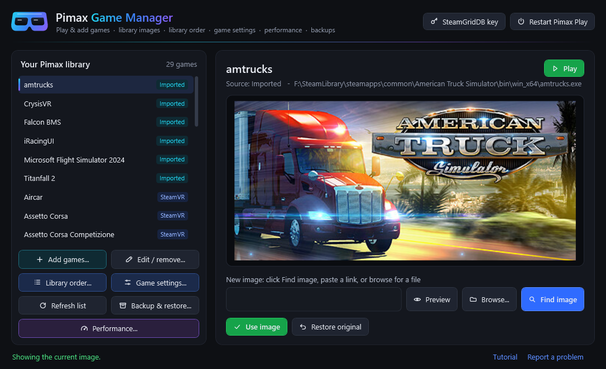
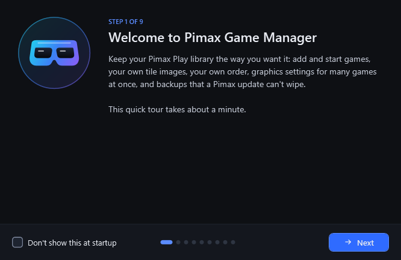
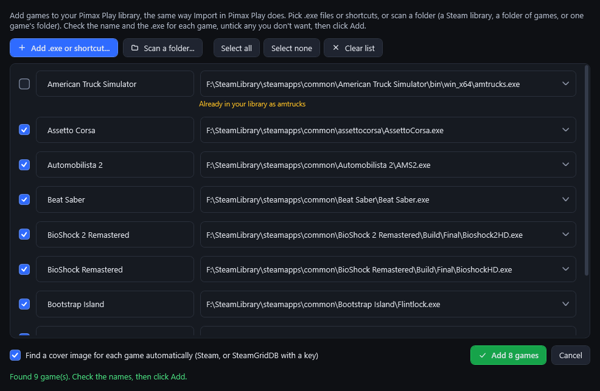
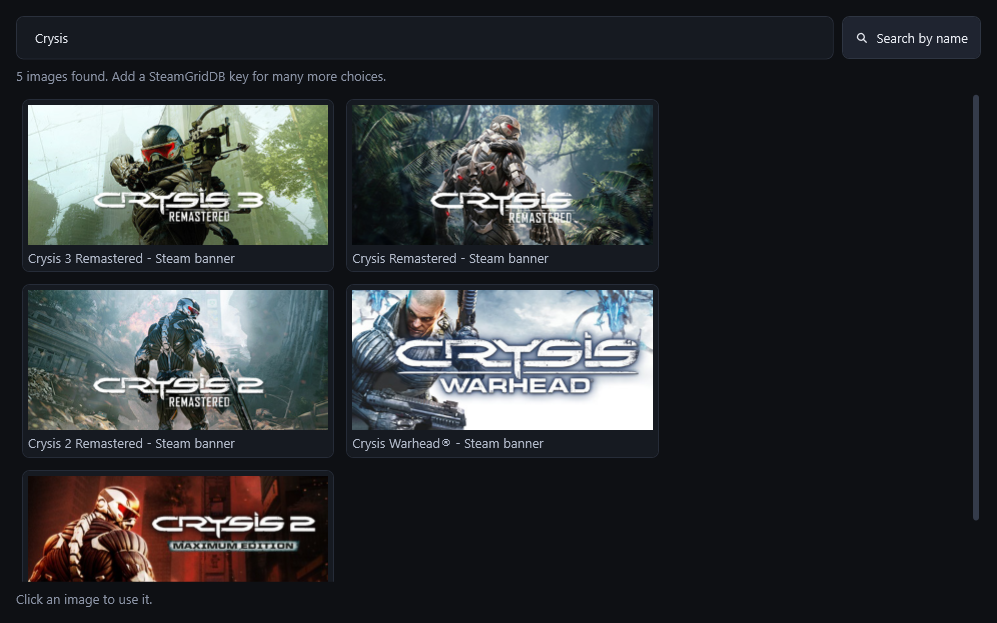
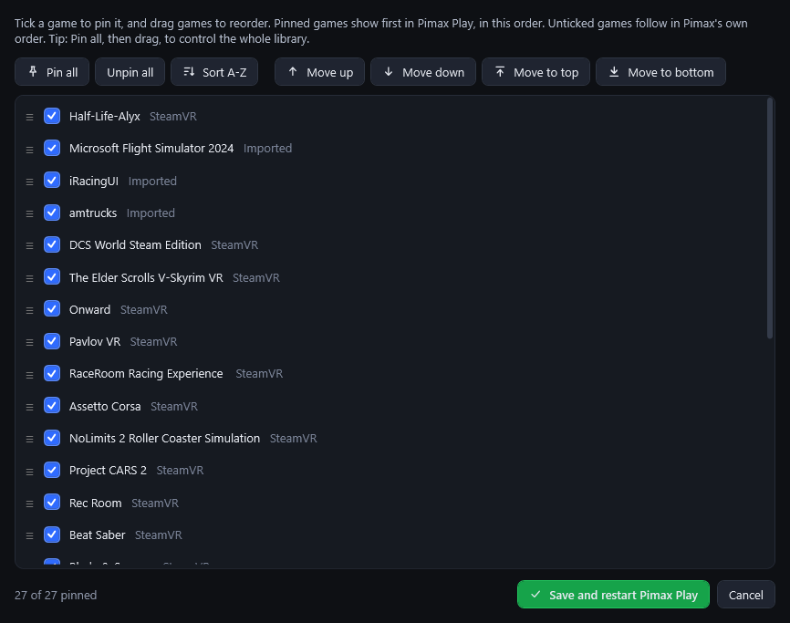
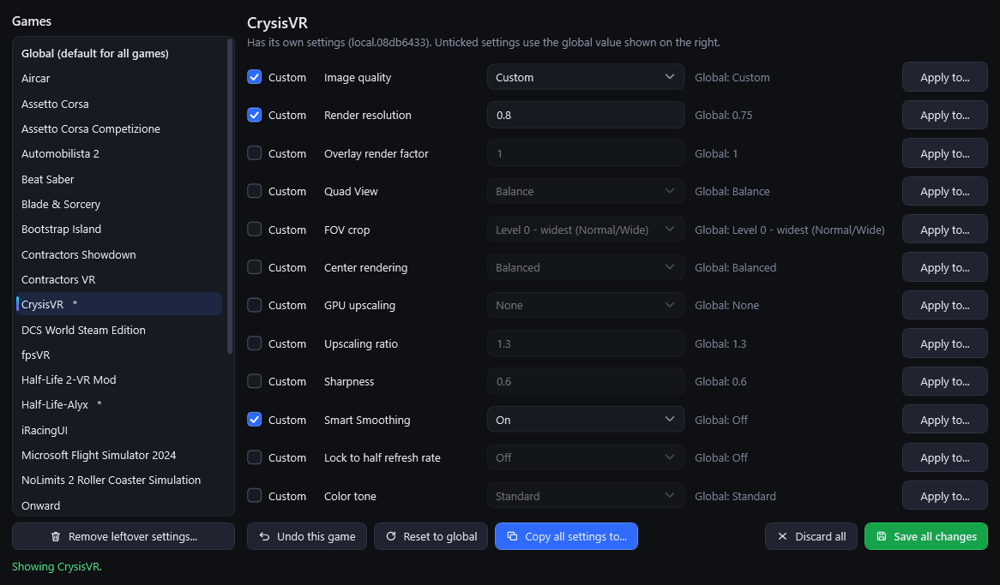
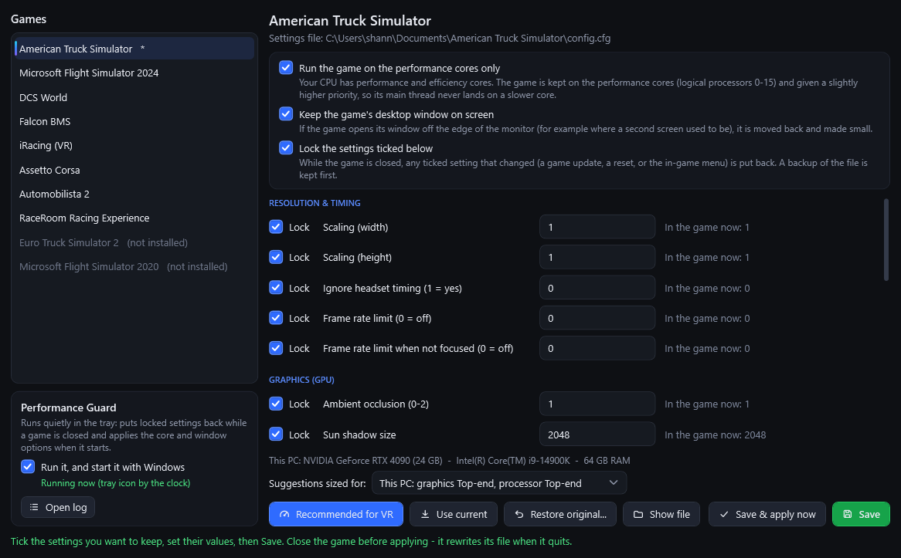
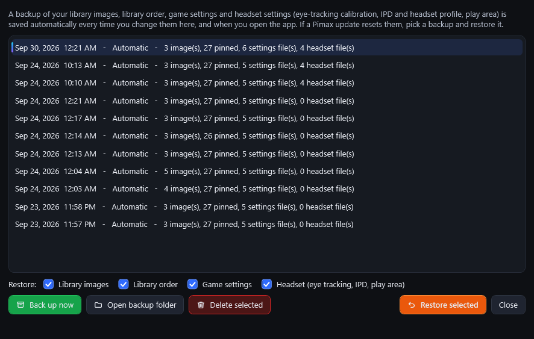

<p align="center"></p>

# Pimax Game Manager

[](https://github.com/SFXShannon/pimax-game-manager/releases) [](https://github.com/SFXShannon/pimax-game-manager/releases/latest) [](LICENSE)

A Windows tool for managing your **Pimax Play** library: add games (one at a time or a whole folder), launch them, set custom cover images, arrange the library in any order, edit per-game settings for many games at once, keep truck, racing and flight sims running smoothly with locked graphics settings, and back it all up so a Pimax update can't wipe your changes.

*Formerly Pimax Cover Changer.*



## Download

Get **`PimaxGameManagerSetup.exe`** from the [latest release](https://github.com/SFXShannon/pimax-game-manager/releases/latest) and run it. It installs to your user folder (no admin needed to install), adds a Start menu shortcut, and asks whether you want a desktop shortcut (ticked by default). To update, run the newer setup over the top. Uninstall from Windows **Settings > Apps**; your backups and settings are kept.

Prefer no install? Download **`PimaxGameManager.exe`** from the same page and run it from anywhere.

The app asks for admin rights when it starts, because it restarts the Pimax service so your changes take effect.

Windows SmartScreen or Defender may warn about it as an unrecognized app. If you'd rather not run the exe, run the script instead (see below). It's the same code.

## First-launch tour

The first time you open the app, a short tour walks through playing games, images, adding games, library order, game settings, performance, backups, applying changes, and updates. Use **Next** / **Back** (or the arrow keys) to step through it.



Tick **Don't show this at startup** to stop it opening each time. You can open it again whenever you like with **Tutorial** at the bottom of the main window.

Even with the tour turned off, when an update adds something new to it (such as **Play** in 1.8.0), just the new steps are shown once, the first time you open the updated app.

## Waiting changes

Adding games, editing or removing them, and changing images don't restart Pimax Play one at a time. They wait in a yellow bar at the top of the window until you're done:

- The library list already shows them: games waiting to be added are marked **New**, and edited games **Changed**. Games waiting to be removed are hidden.
- **Apply & restart Pimax Play** writes everything at once and restarts Pimax Play once. Do it when you're not in a game.
- **Discard** throws the waiting changes away. Nothing has been written to Pimax Play yet.
- If you close the app with changes waiting, it asks whether to apply them, throw them away, or keep working.
- Saving **Library order** or **Game settings**, restoring a backup, **Restart Pimax Play** and updating the app all apply waiting changes in the same restart. Games waiting to be added already appear in Library order and Game settings, so you can place them and set them up before applying.

## Play games

Pick a game and click **Play** (top right), or double-click it in the library list.

- If Pimax Play isn't open, it's opened first (starting its service if needed), and the game starts once Pimax Play and its headset runtime are up. The status line shows what it's waiting for; if Pimax Play doesn't open within a minute, the game isn't started.
- It starts the game the same way Pimax Play does, using the launch path in Pimax's own entry: Steam games through Steam (for example `steam://launch/620980/VR`), and imported and Oculus games from their .exe or shortcut.
- The game runs as you, not as admin, even though the app itself runs as admin. An .exe is started in its own folder, as it would be from Pimax Play.
- If the game's .exe has moved, the status line says so. For imported games, point the entry at the new location with **Edit / remove...**.

Which runtime a game uses (Pimax OpenXR or SteamVR) is still set in Pimax Play, not here.

## Add games

**Add games...** puts games into your Pimax Play library without using Pimax's **Import** button. It creates exactly the same kind of entry Import does, so Pimax treats them as imported games.



- **Add .exe or shortcut...** picks one or more game .exe files or shortcuts (.lnk), for example a mod's launcher shortcut.
- **Scan a folder...** finds the main .exe of every game in a folder: a Steam library (such as `D:\SteamLibrary`), a folder of games, or one game's own folder. It skips uninstallers, crash reporters, servers, redistributables and the like.
- Each row shows the name Pimax will display (edit it if you like) and the program Pimax will start. If the scan picked the wrong .exe, choose another from the dropdown.
- Games already in your library are unticked and marked **Already in your library**, so nothing is added twice.
- **Find a cover image for each game automatically** uses Steam's banner for games in a Steam library, otherwise an exact Steam store match, otherwise SteamGridDB (with a key). Games without a match can be given an image afterwards with **Find image**.
- **Add games** adds everything ticked to your [waiting changes](#waiting-changes). Nothing changes in Pimax Play until you apply them.

SteamVR games already show up in Pimax by themselves. Adding one here as well gives you a second entry that you *can* give your own image.

### Edit or remove an imported game

Pick an imported game and click **Edit / remove...** to:

- **Rename** it.
- **Change the program** it starts, for example to point it at a mod's .exe or launcher.
- **Remove from library**. The game itself isn't touched; only its Pimax Play entry is removed, and it's taken off your pinned list.

Edits and removals are [waiting changes](#waiting-changes) too. The entry is kept in `%APPDATA%\PimaxGameManager\backups\removed-games`. Edits keep a copy of the old entry in `backups\edited-games`.

Steam and Oculus entries can't be edited or removed here, because Pimax rebuilds them from those stores.

## Library images

Custom images work for imported games (added with **Add games** or Pimax's **Import**). For SteamVR and Oculus games, Pimax copies the image from Steam or Oculus every time it starts, so any change is overwritten within seconds; the app shows the current image but won't let you change it. To give a Steam or Oculus game your own image, add its .exe with **Add games** and give that entry an image.

1. Pick an imported game from your Pimax library on the left.
2. Click **Find image** to search for art automatically, or paste an image link, or click **Browse...** for an image file.
3. Click **Use image**. The image is saved and shown straight away, and the change waits with your other [waiting changes](#waiting-changes) until you click **Apply & restart Pimax Play**.

Wide banner images (about 460x215 or 920x430) fit Pimax tiles best.

- **Restore original** puts a game back to its original image (also a waiting change). On an image you haven't applied yet, it just cancels it.
- **Restart Pimax Play** (top right) restarts Pimax, applying any waiting changes.

### Find image

**Find image** shows a gallery of matching art. Click one to use it.



- **Steam:** If the game is a Steam game, or an imported game whose .exe sits in a Steam library folder, the tool reads Steam's install records to get the exact game and shows its official banners. Otherwise it searches the Steam store by name. No account needed.
- **SteamGridDB (optional):** Adds many more choices, including community art and art for non-Steam games. Get a free API key by signing in at [steamgriddb.com](https://www.steamgriddb.com/), then **Preferences > API**. Paste it in with the **SteamGridDB key** button at the top right. The key is stored locally in `%APPDATA%\PimaxGameManager\settings.json`.

If the automatic match is wrong, type a different name in the search box and click **Search by name**.

## Library order

Pimax Play normally lists Steam games by Steam app ID, then Oculus games, then imported games in the order you added them. The only order it lets you set is for **pinned** games, which always come first. **Library order...** uses that to let you arrange the whole library:



- Tick games to pin them, and drag them into the order you want. While dragging, a label shows which game you're moving and a blue line shows where it will land; hold near the top or bottom edge of the list to scroll. **Move up / Move down** and **Move to top / Move to bottom** move the selected game without dragging.
- **Pin all** then drag to control the entire list. **Sort A-Z** sorts alphabetically.
- **Save and restart Pimax Play** writes the order and reopens Pimax Play.

The order is saved in Pimax Play's own pinned list (`pinToTopGameArray` in `%APPDATA%\PimaxClient\config.json`). Only that list is changed; the rest of the file is left exactly as it was, and a backup is made the first time. Games you add later appear below the pinned ones until you place them.

## Game settings

Pimax Play lets you give each game its own graphics settings, one game at a time. **Game settings...** shows them all in one place and lets you work across games:



- **Edit any game**, or the **Global** settings every game uses by default. Tick **Custom** on a setting to give a game its own value; unticked settings follow Global, which is shown next to each one.
- **Apply to...** on any setting copies just that setting to the games you pick. For example, turn on Smart Smoothing for all your sims in one go.
- **Copy all settings to...** gives other games exactly the same settings as the one you're viewing.
- **Reset to global** clears a game's custom settings so it follows Global again. On the Global entry it becomes **Reset to Pimax defaults**.
- **Save all changes** writes everything at once. Your edits are kept as you move between games (games with unsaved changes show in orange), and Apply to, Copy all and Reset are queued too, so Pimax only restarts once. **Undo this game** and **Discard all** throw edits away, and you're asked before closing with unsaved changes.
- **Remove leftover settings...** tidies up settings files for games no longer in your library (for example after re-importing a game, which gives it a new ID).

Settings covered: image quality and render resolution, overlay render factor, Quad View, FOV crop, center rendering, GPU upscaling (algorithm, ratio, sharpness), Smart Smoothing, lock to half refresh rate, and color tone. Games with their own settings are marked with `*` in the list. Advanced fine-tuning (custom Quad View and FOV values, color channels) is kept as-is and is still edited in Pimax Play.

Settings live in `%APPDATA%\Pimax\AppConfig` (`global.json` plus one file per game, named by the game's ID). Each file is backed up to `%APPDATA%\PimaxGameManager\backups\settings` before its first change.

## Performance

Some games keep their own graphics settings in their own file, separate from Pimax's, and quietly reset them after an update or when a setting is changed in the game menu. **Performance...** keeps them the way you tuned them, and helps games whose frame rate is held back by the CPU.



Supported games and the file each one keeps its settings in:

| Game | Settings file |
|---|---|
| American Truck Simulator, Euro Truck Simulator 2 | `config.cfg` in Documents |
| Microsoft Flight Simulator 2024 and 2020 | `UserCfg.opt` (Microsoft Store/Xbox and Steam versions; VR settings only) |
| DCS World | `Saved Games\DCS\Config\options.lua` |
| Falcon BMS | `User\Config\Falcon BMS User.cfg` (BMS reads it after `Falcon BMS.cfg`, and updates don't replace it) |
| iRacing | `Documents\iRacing\rendererDX11OpenXR.ini` (the VR renderer's settings) |
| Assetto Corsa | `Documents\Assetto Corsa\cfg\video.ini` (Content Manager writes this file too, so lock only what you want kept) |
| Automobilista 2 | `Documents\Automobilista 2\graphicsconfigdx11.xml` |
| RaceRoom Racing Experience | `Documents\My Games\SimBin\RaceRoom Racing Experience\UserData\graphics_options.xml` |

Games that aren't installed show as *not found*. Skyrim VR isn't included: mod managers like Mod Organizer 2 keep their own copy of its settings.

For each game:

- **Lock the settings ticked below**: tick **Lock** on a setting and give it a value. While the game is closed, any locked setting that changed is put back. The game's file is backed up to `%APPDATA%\PimaxGameManager\backups\performance` first (the last 20 copies per game are kept). Changes are never made while the game is running, because these games rewrite their file when they quit.
- **Recommended for VR** fills in a starting point for VR, sized for your PC: the app reads your graphics card, processor and memory (shown above the buttons) and sorts each into Entry, Mid-range, High-end or Top-end. Graphics settings follow the graphics card and world-detail settings follow the processor, so a strong GPU with an older CPU gets sharp graphics with a lighter world. Pick another level in **Suggestions sized for** to override it. Frame pacing is always left to the headset, and blur effects stay off. Settings without a suggestion are left alone; hover a setting to see what it does.
- **Use current** copies what the game has now into the ticked settings, so you can tune in the game and then lock it.
- **Restore original...** puts the game's file back the way it was before the app first changed it (a copy is kept the first time), and turns locking off so you can compare. Your locked values are kept: click **Save & apply now** to switch back (locking turns back on).
- **Run the game on the performance cores only**: on CPUs with performance and efficiency cores (Intel 12th gen and later), the game is kept on the performance cores and given a slightly higher priority, so its main thread never lands on a slower core. Driving and flight sims are often limited by one CPU thread, so this can remove stutters. Hidden on CPUs where all cores are the same.
- **Keep the game's desktop window on screen**: if the game opens its desktop window off the edge of the monitor (often where a second screen used to be), it's moved back and made small.
- **Save** stores your choices; **Save & apply now** also writes the locked settings into the game's file straight away (close the game first).

### Performance Guard

The locks and the core and window options are carried out by the **Performance Guard**, a small part of the app that runs in the background with a tray icon by the clock. Turn it on with **Run it, and start it with Windows** at the bottom left of the Performance window. It starts at sign-in from a Windows scheduled task (`Pimax Game Manager Performance Guard`), so there's no admin prompt, and it checks about every 3 seconds using almost no CPU.

Hover over the tray icon to see whether it's on and how many games it looks after; right-click it to see each game and what's set for it, **Pause** or **Resume** it, put locked settings back straight away, open the app, open the log (`%APPDATA%\PimaxGameManager\performance.log`), or exit until you next sign in. A notification tells you when it puts settings back. Turning it off in the Performance window removes it from startup.

Your choices are stored in `%APPDATA%\PimaxGameManager\performance.json`.

## Backup & restore

Pimax updates sometimes reset library images, the library order, game settings or your headset setup. Pimax Game Manager keeps its own backups so you can put them back.

What's backed up:

- **Library images** for imported games
- **Library order**
- **Game settings**: global and per-game
- **Headset settings**: eye-tracking calibration, the headset profile (IPD, custom FOV crop, Quad View fine-tuning, audio switching) and the play area / boundary



- **Automatic backups:** every time you apply an image, save the library order or save game settings, and each time you open the app, a backup is saved (only when something changed). The newest 20 automatic backups are kept; ones you make with **Back up now** are kept until you delete them.
- **Reset detection:** when the app opens it compares Pimax with your latest backup. If images, the order, settings files or headset files (such as the eye-tracking calibration) have gone missing, an orange bar offers to **Restore** them.
- **Restore:** in **Backup & restore...**, pick a backup and choose what to restore: library images, library order, game settings, headset settings, or any mix. Restoring headset settings briefly restarts the Pimax headset software (take the headset off first); it comes back on its own. Your current state is backed up first, so a restore can be undone. Games that were removed and imported again get a new ID in Pimax; they are matched by their .exe path.
- **Delete:** select one or more backups (Ctrl-click or Shift-click for several) and click **Delete selected**.

Backups are stored in %APPDATA%\PimaxGameManager\snapshots, outside Pimax's folders. Each one is a folder with the images, the settings files and a snapshot.json describing the library order and which image goes with which game.

## Updates

When the app opens, it checks this repo for a newer release in the background. (If you have waiting changes when you click **Update now**, it asks whether to apply them first.) If there is one, a bar at the top offers **Update now**. Click it and the app:

1. downloads the new version from the GitHub release (progress shows in the bar),
2. checks the download (its size, GitHub's SHA-256 checksum when listed, and the version number inside the file),
3. closes, installs the update, and reopens by itself.

If you installed with `PimaxGameManagerSetup.exe`, the new setup runs silently into the same folder, keeping your shortcuts. If you use the plain `PimaxGameManager.exe`, that file is replaced where it is; the old one is only removed once the new one is in place. Nothing is ever downloaded or installed until you click **Update now**. Your backups, images and settings are not touched. Each update is logged in `%APPDATA%\PimaxGameManager\update.log`.

Running the `.ps1` script instead of the exe? The button says **Download** and opens the release page.

The bottom-right corner shows the app version and whether it's **Up to date**, has an **Update available** (click to show the update bar), or **Couldn't check** (for example when offline). Click it to check again.

*Updating in the app works from version 1.7.1 onward. If you have an older version, download 1.7.1 once from the [releases page](https://github.com/SFXShannon/pimax-game-manager/releases/latest).*

## Feedback & bug reports

- **Found a bug?** [Open a bug report](https://github.com/SFXShannon/pimax-game-manager/issues/new?template=bug_report.yml). The **Report a problem** link in the bottom-right of the app opens it with your app version filled in.
- **Have an idea?** [Suggest a feature](https://github.com/SFXShannon/pimax-game-manager/issues/new?template=feature_request.yml), or post it under Ideas in [Discussions](https://github.com/SFXShannon/pimax-game-manager/discussions).
- **Need help or have a question?** Ask in [Discussions](https://github.com/SFXShannon/pimax-game-manager/discussions/categories/q-a).
- **No GitHub account?** Join the conversation in the [r/Pimax thread](https://www.reddit.com/r/Pimax/comments/1woshmk/).

Posting on GitHub needs a free account.

## How it works

Pimax Play keeps each library entry as a JSON file in `%APPDATA%\Pimax\manifest`. The tile image comes from the entry's `icon` field, which accepts a web link or a local file path. This tool:

- copies the chosen image to `%APPDATA%\PimaxGameManager\covers` so it keeps working offline, if the original moves, and if Pimax clears its own folder,
- backs up the original entry to `%APPDATA%\PimaxGameManager\backups` the first time you change it,
- adds games by writing a new entry file of the same form Pimax's Import makes (`"source":"pimax_import"`, a random `local.xxxxxxxx` ID, the game's name and the .exe or shortcut to start), and checks the .exe path so a game isn't added twice,
- launches a game by opening the entry's `route` through Explorer, so it runs as you rather than as admin; for a plain .exe it first writes a small shortcut to `%APPDATA%\PimaxGameManager\launch` that sets the game's folder as its working folder,
- writes files back as UTF-8 **without a BOM** (Pimax silently drops entries saved with one),
- for **Performance**, edits only the lines of a game's own settings file that you locked, keeping its encoding and line endings, and only while the game is closed,
- restarts Pimax: it stops Pimax Play, the `PiServiceLauncher` service and `PiPlayService.exe` (which holds the library and settings in memory and survives a plain service restart), then starts them again. Game settings are written while Pimax is stopped so it can't overwrite them.

## Notes

- Custom images only work for imported games; Pimax rebuilds Steam and Oculus entries from those stores every time it starts.
- Tested with Pimax Play 2.x. A future Pimax update could change how this works.

## Run from the script

```powershell
powershell -ExecutionPolicy Bypass -File .\PimaxGameManager.ps1
```

Add `-Guard` to run only the Performance Guard.

## Build the exe yourself

```powershell
Install-Module ps2exe -Scope CurrentUser
Invoke-ps2exe .\PimaxGameManager.ps1 .\PimaxGameManager.exe -iconFile .\PimaxGameManager.ico -noConsole -requireAdmin -STA -title "Pimax Game Manager" -version 1.10.0
```

To build the installer too, install [Inno Setup 6](https://jrsoftware.org/isinfo.php) and run:

```powershell
& "$env:LOCALAPPDATA\Programs\Inno Setup 6\ISCC.exe" /DAppVersion=1.10.0 .\PimaxGameManager.iss
```

The app icon and `assets/logo.png` are generated from the logo shapes used in the app:

```powershell
powershell -STA -ExecutionPolicy Bypass -File .\tools\Make-Icon.ps1
```

## License

[MIT](LICENSE)

Not affiliated with Pimax or Valve. Game art belongs to its respective owners.
